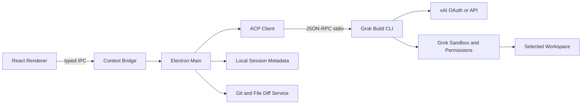

# Grok Desktop 구현 명세

- 문서 상태: 구현 준비 완료 초안
- 기준일: 2026-08-14
- 프로젝트 경로: `<프로젝트 루트>`
- 목표 플랫폼: macOS 우선, 이후 Windows
- 핵심 방식: Electron GUI가 공식 Grok Build CLI의 ACP 에이전트와 통신

## 1. 문서 목적

이 문서는 사용자의 컴퓨터에서 선택한 폴더와 파일을 Grok이 읽고, 사용자의 승인을 받아 수정하고, 필요한 명령과 테스트를 실행할 수 있는 데스크톱 앱을 구현하기 위한 실행 명세다.

목표는 단순히 `grok.com`을 Electron WebView로 감싸는 앱이 아니다. ChatGPT Desktop, Codex Desktop, Claude Desktop/Cowork처럼 다음 작업 흐름을 제공하는 로컬 에이전트 앱을 만드는 것이다.

1. 사용자가 작업 폴더를 선택한다.
2. Grok이 폴더 구조와 파일을 읽는다.
3. Grok이 작업 계획 또는 변경안을 제시한다.
4. 파일 쓰기, 삭제, 명령 실행처럼 상태가 바뀌는 작업은 사용자에게 승인받는다.
5. 변경 전후 diff와 명령 결과를 앱에서 확인한다.
6. 작업 세션을 저장하고 나중에 이어서 진행한다.

## 2. 최종 결과물

### 2.1 사용자에게 제공할 앱

최종 산출물은 다음 기능을 가진 설치형 `Grok Desktop` 앱이다.

- xAI 계정 브라우저 로그인
- 프로젝트 폴더 선택 및 최근 프로젝트 목록
- Grok 응답 실시간 스트리밍
- 프로젝트 파일 탐색기
- 파일 읽기와 코드 검색
- 파일 수정 전 diff 검토
- 파일 쓰기·삭제·이동 승인 또는 거부
- 터미널 명령 실행 승인 또는 거부
- 실행 로그, 종료 코드, 테스트 결과 표시
- Ask, Plan, Agent 작업 모드
- 작업 중단과 세션 재개
- 작업공간별 권한 설정
- macOS 설치 이미지 또는 서명된 앱 번들
- 이후 Windows 설치 프로그램

### 2.2 저장소 산출물

구현이 완료되면 저장소에는 최소 다음 결과물이 있어야 한다.

```text
grok-desktop/
├── apps/
│   └── desktop/                 # Electron 애플리케이션
├── packages/
│   ├── acp-client/              # Grok ACP JSON-RPC 클라이언트
│   ├── shared/                  # 공통 타입과 스키마
│   └── security/                # 경로·권한·명령 정책
├── docs/
│   ├── GROK_DESKTOP_IMPLEMENTATION_SPEC.md
│   ├── SECURITY_MODEL.md
│   ├── ACP_PROTOCOL_NOTES.md
│   └── RELEASE_CHECKLIST.md
├── tests/
│   ├── fixtures/
│   └── security/
├── package.json
├── pnpm-workspace.yaml
├── tsconfig.base.json
└── README.md
```

## 3. 제품 범위

### 3.1 MVP에 포함하는 기능

MVP는 다음 수직 흐름이 처음부터 끝까지 동작하는 상태를 의미한다.

> 로그인 → 폴더 선택 → 질문 → Grok의 파일 읽기 → 변경 제안 → diff 승인 → 파일 수정 → 테스트 실행 → 결과 표시

MVP 기능 목록:

- Grok CLI 설치 여부와 버전 확인
- `grok login`을 이용한 로그인 시작
- Electron 폴더 선택 창
- 선택한 폴더를 `cwd`로 하는 ACP 세션 생성
- ACP 메시지 및 스트리밍 이벤트 수신
- 채팅 메시지와 도구 실행 이벤트 표시
- 읽기 작업 자동 허용 또는 사용자 설정
- 쓰기 및 명령 실행 승인 UI
- 변경 파일 목록과 Git diff 표시
- 실행 중인 작업 취소
- 로컬 세션 메타데이터 저장
- 오류와 복구 안내

### 3.2 MVP에서 제외하는 기능

다음 기능은 핵심 흐름이 안정화된 후 구현한다.

- 일반 `grok.com` 웹 대화 기록과의 완전한 동기화
- 음성 대화
- 이미지 및 영상 생성
- 화면 전체 자동 조작
- 무제한 Always Approve 모드
- 클라우드 드라이브 동기화
- 팀 관리자 콘솔
- 자체 플러그인 마켓플레이스
- 앱 내부 Grok CLI 자동 업데이트
- 모바일 앱

### 3.3 비목표

- xAI 인증 쿠키를 가로채거나 복사하지 않는다.
- `grok.com` 내부 비공개 REST API에 의존하지 않는다.
- 사용자의 Grok 또는 X 비밀번호를 앱이 직접 받지 않는다.
- 사용자가 선택하지 않은 홈 디렉터리 전체를 자동으로 스캔하지 않는다.
- 승인 없이 삭제, 외부 전송, Git push, 패키지 설치를 실행하지 않는다.

## 4. 핵심 기술 결정

### 4.1 Grok 연결: ACP 우선

앱은 모델 API를 직접 호출해 자체 에이전트 루프를 처음부터 만들지 않는다. 공식 Grok Build CLI를 로컬 에이전트 런타임으로 사용하고 다음 명령을 자식 프로세스로 실행한다.

```bash
grok agent stdio
```

이 프로세스는 stdin/stdout의 JSON-RPC로 통신한다. Electron 메인 프로세스는 ACP 클라이언트 역할을 하고 renderer는 허용된 IPC만 사용한다.

ACP 우선 방식의 장점:

- 공식 Grok 로그인 흐름 재사용
- Grok의 파일 도구와 명령 실행 기능 재사용
- 세션, 권한, 샌드박스, MCP 기능 재사용
- 모델 및 프로토콜 변경 대응 범위 축소
- 직접 구현해야 할 보안 민감 코드 감소

대안인 xAI Responses API 직접 연결은 2단계 이후의 fallback/provider 모드로 남긴다. 직접 API 모드에서는 파일 읽기·쓰기·명령 실행·승인·샌드박스·도구 루프를 모두 앱이 구현해야 한다.

### 4.2 데스크톱 프레임워크

- Electron
- React
- TypeScript strict mode
- Vite
- 상태 관리: 작은 전역 store 하나만 사용
- 런타임 스키마 검증: Zod 계열
- 로컬 데이터: SQLite 또는 Electron의 안전한 앱 데이터 경로
- 패키징: electron-builder 또는 Electron Forge 중 초기 스파이크 후 하나로 고정

Electron을 선택하는 이유는 ACP 자식 프로세스, 스트리밍 JSON, 자동 업데이트, macOS/Windows 패키징과 웹 기반 채팅 UI를 한 TypeScript 코드베이스에서 구현하기 쉽기 때문이다.

### 4.3 인증

기본 인증은 공식 CLI의 브라우저 OAuth/OIDC 로그인을 사용한다.

```bash
grok login
```

앱은 비밀번호나 세션 토큰을 renderer로 전달하지 않는다. 로그인 상태 확인과 로그인 프로세스 시작은 main process에서만 수행한다. API 키 방식은 개발·CI 또는 사용자가 명시적으로 선택했을 때만 제공하며 OS 보안 저장소를 사용한다.

### 4.4 작업공간 모델

한 세션은 하나의 작업공간 루트에 속한다.

```text
Workspace
├── rootPath
├── canonicalRootPath
├── displayName
├── sessionId
├── permissionProfile
├── sandboxProfile
└── createdAt / lastOpenedAt
```

사용자가 다른 폴더를 추가하면 별도의 작업공간이나 명시적인 추가 루트로 등록한다. 프롬프트 텍스트만으로 경계를 설정하지 않고 CLI 샌드박스와 앱의 경로 검증을 함께 사용한다.

## 5. 전체 아키텍처



### 5.1 프로세스 경계

#### Renderer

허용 기능:

- 화면 렌더링
- 사용자 입력 수집
- 승인·거부 의사 전달
- main process가 전달한 안전한 이벤트 표시

금지 기능:

- Node.js 직접 사용
- 파일시스템 직접 접근
- `child_process` 직접 사용
- API 키 또는 OAuth 토큰 접근
- 임의 IPC 채널 호출

#### Preload

`contextBridge`로 최소 API만 노출한다.

```ts
interface DesktopBridge {
  auth: {
    getStatus(): Promise<AuthStatus>;
    startLogin(): Promise<void>;
  };
  workspace: {
    choose(): Promise<WorkspaceSummary | null>;
    listRecent(): Promise<WorkspaceSummary[]>;
  };
  session: {
    create(input: CreateSessionInput): Promise<SessionSummary>;
    prompt(input: PromptInput): Promise<void>;
    cancel(sessionId: string): Promise<void>;
    decidePermission(input: PermissionDecision): Promise<void>;
    subscribe(listener: (event: SessionEvent) => void): () => void;
  };
}
```

#### Main process

- 폴더 선택 다이얼로그
- 경로 canonicalization
- Grok CLI 설치 및 버전 검사
- ACP 프로세스 수명주기
- typed IPC 검증
- 세션 메타데이터 저장
- diff 계산
- 외부 링크 검증
- 앱 종료 시 자식 프로세스 정리

#### Grok CLI

- xAI 인증
- Grok 모델 통신
- 에이전트 루프
- 도구 선택
- 파일 및 명령 도구
- 권한 요청
- 샌드박스
- MCP, skills, project instructions 탐색

## 6. 주요 사용자 흐름

### 6.1 최초 실행

1. 앱이 `grok` 실행 파일을 검색한다.
2. 없으면 설치 안내 화면을 표시한다.
3. 설치 버튼은 실제 실행 명령과 설치 위치를 먼저 보여준다.
4. 설치가 완료되면 버전을 다시 확인한다.
5. 로그인 상태를 확인한다.
6. 로그인이 필요하면 브라우저 로그인 버튼을 제공한다.
7. 인증 완료 후 프로젝트 선택 화면으로 이동한다.

현재 개발 환경에는 Node.js와 npm은 있지만 `grok` CLI는 설치되어 있지 않다. CLI 설치는 구현 시작 시 사용자의 명시적 승인을 받고 진행한다.

### 6.2 폴더 열기

1. 사용자가 `폴더 열기`를 누른다.
2. 네이티브 폴더 선택 창을 연다.
3. 선택 경로의 실제 경로를 계산한다.
4. 경로가 존재하고 디렉터리인지 검증한다.
5. 위험하거나 너무 넓은 경로는 경고한다.
6. 권한 프로필을 선택한다.
7. 해당 경로를 cwd로 ACP 세션을 만든다.

기본 차단 또는 강한 경고 대상:

- `/`
- 사용자 홈 전체
- 운영체제 시스템 디렉터리
- SSH, 브라우저 프로필, Keychain 관련 디렉터리
- 외장 디스크 전체 루트

### 6.3 질문과 파일 읽기

1. 사용자가 요청을 입력한다.
2. main process가 ACP `session/prompt` 요청을 전송한다.
3. `session/update` 이벤트를 renderer에 전달한다.
4. 텍스트 delta는 실시간으로 표시한다.
5. 파일 읽기와 검색 이벤트는 접을 수 있는 작업 카드로 표시한다.
6. 완료 또는 오류 상태를 기록한다.

### 6.4 파일 수정

1. Grok이 Edit/Write 도구를 요청한다.
2. 권한 엔진이 작업 경로와 작업 종류를 평가한다.
3. 자동 허용이 아니면 승인 카드를 표시한다.
4. 카드에는 대상 파일, 작업 설명, 예상 변경 범위를 표시한다.
5. 사용자가 승인 또는 거부한다.
6. 실행 후 실제 diff를 계산한다.
7. diff와 되돌리기 가능 여부를 결과 카드에 표시한다.

### 6.5 명령 실행

승인 화면에 다음 항목을 표시한다.

- 전체 명령 문자열
- 실행 디렉터리
- 예상 목적
- 네트워크 사용 가능성
- 파일 변경 가능성
- 제한 시간

다음 명령 유형은 항상 승인받는다.

- 파일 삭제 또는 대량 이동
- 패키지 설치
- `git push`, 배포, 릴리스
- `curl`, `wget` 등의 외부 전송
- 권한 변경
- 관리자 권한 요청
- 데이터베이스 마이그레이션
- 시스템 설정 변경

## 7. 권한 모델

### 7.1 기본 프로필

#### Read Only

- 읽기, 검색, 디렉터리 목록 허용
- 파일 수정·명령 실행 금지

#### Ask Every Change

- 읽기와 검색 허용
- 쓰기, 삭제, 명령 실행은 매번 승인
- MVP 기본값

#### Trusted Workspace

- 작업공간 내부 일반 파일 수정 허용 가능
- 삭제, 네트워크, Git push, 설치는 계속 승인
- MVP 이후 제공

### 7.2 승인의 범위

승인 선택지는 다음처럼 제한한다.

- 이번 한 번 허용
- 동일 도구를 이 세션 동안 허용
- 거부

영구적인 광범위 허용은 MVP에서 제공하지 않는다. `Always Approve`는 보안 고급 설정으로 분리하고 충분한 경고와 deny rule이 준비된 뒤 검토한다.

### 7.3 이중 통제

권한은 두 계층에서 동시에 적용한다.

1. 앱 권한 정책: UI 승인과 경로 검사
2. Grok CLI 권한 및 sandbox: 실제 실행 제한

한 계층이 실패해도 다른 계층이 피해 범위를 제한해야 한다.

## 8. 보안 설계와 위협 모델

### 8.1 보호 대상

- 사용자 프로젝트 소스 코드
- 개인 문서
- API 키와 OAuth 토큰
- Git 자격 증명
- SSH 키
- 브라우저 세션
- 작업 결과와 대화 기록
- 로컬 시스템 무결성

### 8.2 주요 위협

- 악성 저장소의 prompt injection
- README나 소스 주석에 포함된 도구 실행 유도
- 작업공간 밖 경로 접근
- 심볼릭 링크를 통한 경계 탈출
- 셸 명령을 통한 데이터 유출
- 패키지 설치 스크립트의 임의 코드 실행
- renderer XSS에서 로컬 권한 획득
- 변조된 Grok CLI 또는 업데이트
- 승인 UI와 실제 실행 내용 불일치
- 로그에 비밀정보 기록

### 8.3 필수 통제

- `nodeIntegration: false`
- `contextIsolation: true`
- renderer sandbox 활성화
- 강한 CSP와 inline/eval 금지
- IPC 채널별 Zod 스키마 검증
- IPC sender 검증
- 외부 URL은 `https` allowlist와 OS 브라우저 사용
- 모든 파일 경로를 realpath로 정규화한 뒤 루트 내부인지 확인
- 명령 승인 이후 실제 실행 문자열 변경 금지
- stdout/stderr의 비밀 패턴 마스킹
- `.env`, 개인 키, 브라우저 DB 기본 민감 경고
- 자식 프로세스에 필요한 환경변수만 전달
- 앱 종료 시 프로세스 그룹 종료
- 설치 파일 해시와 서명 검증
- 보안 이벤트 로깅

### 8.4 데이터 유출 방지

선택한 폴더 안의 파일도 자동으로 외부에 모두 전송하면 안 된다. Grok이 필요한 파일을 도구로 읽고, 읽은 파일과 외부 전송 여부를 UI에서 확인할 수 있어야 한다.

네트워크와 셸 권한이 동시에 주어질 경우 파일 내용을 외부로 전송할 수 있으므로 다음 정책을 적용한다.

- 네트워크 명령은 별도 승인
- 민감 파일 읽기 후 네트워크 명령은 강화된 경고
- 터미널 출력에 토큰과 비밀 값 마스킹
- 원격 MCP는 도메인과 권한을 명시적으로 표시

## 9. 화면 설계

### 9.1 온보딩

- Grok CLI 감지 상태
- 설치 안내
- xAI 로그인 상태
- 폴더 열기
- 개인정보 및 권한 안내

### 9.2 메인 작업 화면

```text
┌───────────────────────────────────────────────────────────┐
│ 프로젝트명   Ask | Plan | Agent            사용량  설정   │
├──────────────┬────────────────────────────────────────────┤
│ 세션         │ 채팅 스트림                                │
│ 프로젝트     │                                            │
│ 파일 탐색기  │ 도구 실행 카드                             │
│ 변경 파일    │ 승인 카드                                  │
│              │ diff / 명령 출력                            │
├──────────────┴────────────────────────────────────────────┤
│ 첨부   @파일   요청 입력                       중단/전송   │
└───────────────────────────────────────────────────────────┘
```

### 9.3 승인 카드

- 동작 종류 아이콘
- 대상 파일 또는 명령
- 경로와 cwd
- 위험도
- Grok이 제시한 이유
- 변경 미리보기
- 한 번 승인 / 세션 승인 / 거부

### 9.4 diff 뷰

- 파일별 변경 목록
- unified 또는 side-by-side 전환
- 추가·삭제 라인 수
- 전체 파일 열기
- 변경 되돌리기
- 테스트 결과 연결

## 10. 데이터 모델

로컬 DB에는 인증 토큰을 저장하지 않는다. 인증 정보는 Grok CLI 또는 OS 보안 저장소가 관리한다.

```ts
type WorkspaceRecord = {
  id: string;
  rootPath: string;
  canonicalRootPath: string;
  displayName: string;
  permissionProfile: 'read-only' | 'ask' | 'trusted';
  lastOpenedAt: string;
};

type SessionRecord = {
  id: string;
  grokSessionId?: string;
  workspaceId: string;
  title: string;
  status: 'idle' | 'running' | 'waiting-approval' | 'failed';
  createdAt: string;
  updatedAt: string;
};

type ApprovalRecord = {
  id: string;
  sessionId: string;
  tool: string;
  target?: string;
  command?: string;
  decision: 'approved-once' | 'approved-session' | 'denied';
  createdAt: string;
};
```

대화 전체 저장은 ACP/Grok 세션과 중복되지 않도록 초기에는 UI 복구에 필요한 최소 메타데이터와 이벤트 캐시만 보관한다.

## 11. ACP 클라이언트 구현

### 11.1 프로세스 시작

```ts
spawn(grokPath, ['agent', 'stdio', '--no-auto-update'], {
  cwd: workspace.canonicalRootPath,
  stdio: ['pipe', 'pipe', 'pipe'],
  env: sanitizedEnvironment,
});
```

개발 단계에서는 시스템에 설치된 Grok CLI를 사용한다. CLI 바이너리를 앱에 번들링하는 것은 재배포 라이선스와 업데이트 정책을 확인한 뒤 결정한다.

### 11.2 통신 계층

- stdout은 줄 단위 JSON-RPC 파서로 처리
- stderr는 사용자 로그와 진단 로그로 분리
- request ID별 Promise map 유지
- 프로세스 시작, 준비, 종료, 재시작 상태 머신 구현
- 요청 timeout과 취소 처리
- 잘못된 JSON 한 줄이 전체 앱을 종료하지 않도록 격리
- 세션 이벤트는 discriminated union으로 검증

### 11.3 상태 머신

```text
not-installed
  → unauthenticated
  → starting
  → ready
  → session-active
  → waiting-approval
  → running
  → completed

어느 상태에서든 → failed → recover/restart
```

### 11.4 장애 복구

- CLI 없음: 설치 안내
- 인증 만료: 재로그인 안내
- CLI 비정상 종료: 마지막 stderr와 재시작 버튼
- ACP timeout: 취소 후 세션 복구 시도
- 작업 폴더 삭제: 세션 잠금 및 새 폴더 선택
- 네트워크 단절: 재시도 가능 상태 유지
- 프로토콜 버전 불일치: 지원 버전과 감지 버전 표시

## 12. IPC 설계

허용 IPC는 도메인별로 명시한다.

```text
auth:get-status
auth:start-login
runtime:get-status
runtime:install-request
workspace:choose
workspace:list
session:create
session:prompt
session:cancel
session:permission-decision
session:event
diff:get
external:open-safe-url
```

금지 사항:

- 범용 `ipc.send(channel, payload)` 노출
- renderer에서 임의 셸 명령 전달
- renderer에서 임의 파일 경로 읽기
- sender frame 검증 없는 privileged IPC

## 13. 구현 단계

### Phase 0. 기술 스파이크

작업:

- 공식 Grok CLI 설치
- `grok login` 확인
- 샘플 폴더에서 `grok -p` 실행
- `grok agent stdio`로 ACP 연결
- 세션 생성과 스트리밍 이벤트 캡처
- 권한 요청 이벤트 형태 확인
- sandbox 프로필별 실제 파일 접근 범위 확인

완료 기준:

- 테스트 폴더 파일을 읽고 답변할 수 있다.
- 쓰기 요청을 승인 또는 거부할 수 있다.
- JSON-RPC 이벤트 샘플을 fixtures로 저장한다.
- 인증 방식과 사용량 집계 위치를 실제 계정에서 확인한다.

### Phase 1. 안전한 Electron 뼈대

작업:

- Electron + React + TypeScript scaffold
- main/preload/renderer 분리
- strict CSP
- typed IPC
- CI lint, typecheck, unit test
- 폴더 선택과 최근 프로젝트 저장

완료 기준:

- renderer에 Node.js가 없다.
- 임의 IPC 호출이 거부된다.
- 선택 폴더 밖 경로가 거부된다.
- 개발 및 production 빌드가 성공한다.

### Phase 2. ACP 채팅

작업:

- Grok CLI 감지
- 로그인 흐름
- ACP 프로세스 manager
- 세션 생성
- prompt와 streaming UI
- 취소와 재시작

완료 기준:

- 앱에서 질문하고 스트리밍 답변을 받는다.
- 선택한 cwd가 세션에 정확히 적용된다.
- 앱 종료 후 자식 프로세스가 남지 않는다.

### Phase 3. 파일 읽기와 탐색

작업:

- 파일 트리
- `@파일` 참조
- 읽기·검색 도구 이벤트 카드
- 대용량 파일과 binary 제외 정책
- 민감 파일 경고

완료 기준:

- Grok이 선택한 폴더 구조를 설명한다.
- 특정 파일을 읽고 근거가 된 경로를 표시한다.
- 폴더 밖 파일 읽기 시도가 차단된다.

### Phase 4. 수정과 승인

작업:

- permission request UI
- 파일 변경 전후 snapshot
- diff viewer
- 승인/거부 응답
- 되돌리기

완료 기준:

- 승인 전에는 파일이 변경되지 않는다.
- 승인한 파일만 변경된다.
- 거부 시 Grok이 거부 결과를 받고 대안을 제시할 수 있다.
- 실제 diff와 UI diff가 일치한다.

### Phase 5. 명령과 테스트

작업:

- Bash/tool 카드
- 명령, cwd, 위험도 표시
- stdout/stderr streaming
- timeout과 cancel
- 위험 명령 분류
- 네트워크 및 설치 명령 추가 경고

완료 기준:

- 테스트 명령을 승인 후 실행한다.
- 출력과 종료 코드를 표시한다.
- 실행 취소가 실제 프로세스에 전달된다.
- 삭제·배포 명령은 자동 승인되지 않는다.

### Phase 6. 세션과 품질

작업:

- 세션 목록·이름 변경·재개
- 오류 복구
- 진단 로그 export
- 접근성 및 키보드 탐색
- 성능 최적화

완료 기준:

- 앱 재시작 후 프로젝트와 세션을 재개한다.
- 긴 출력과 다수 파일에서도 UI가 멈추지 않는다.
- 민감정보가 진단 로그에 남지 않는다.

### Phase 7. 배포

작업:

- 앱 아이콘과 독립 브랜드
- macOS hardened runtime
- 코드 서명과 notarization
- 설치·제거 테스트
- 업데이트 서명 검증
- Windows 패키징 준비

완료 기준:

- 깨끗한 macOS 계정에서 설치 및 실행된다.
- 변조된 업데이트가 거부된다.
- 설치 전 요구사항과 데이터 저장 위치가 문서화된다.

## 14. 테스트 전략

### 14.1 단위 테스트

- 경로 containment
- 심볼릭 링크 처리
- IPC 스키마
- ACP JSON-RPC parser
- request timeout
- 권한 규칙 우선순위
- 비밀정보 마스킹
- 위험 명령 분류

### 14.2 통합 테스트

- fake ACP server를 이용한 정상 스트리밍
- 잘못된 JSON과 프로세스 crash
- 승인/거부 왕복
- CLI 로그인 만료
- 파일 변경 diff 생성
- 세션 재시작

### 14.3 보안 테스트

- `../` 경로 탈출
- symlink 경계 탈출
- 악성 파일명의 UI injection
- Markdown XSS
- IPC sender 위조
- `file:`, `javascript:`, custom scheme 외부 열기
- 명령 인자 변조
- 승인 후 payload 교체
- 환경변수와 로그의 secret leakage
- 악성 저장소 prompt injection

### 14.4 E2E 테스트

테스트용 fixture 프로젝트에서 다음 시나리오를 자동화한다.

1. 폴더 열기
2. 파일 설명 요청
3. 파일 수정 요청
4. 승인 카드 확인
5. 변경 승인
6. diff 확인
7. 테스트 실행 승인
8. 성공 결과 확인
9. 앱 재시작
10. 세션 재개

## 15. 개발 명령의 목표 형태

프로젝트 scaffold 이후 다음 명령을 제공한다.

```bash
pnpm install
pnpm dev
pnpm lint
pnpm typecheck
pnpm test
pnpm test:security
pnpm test:e2e
pnpm build
pnpm package:mac
```

현재 시스템 Node.js는 비 LTS 개발 버전일 수 있으므로 프로젝트 생성 시 Electron 도구가 지원하는 Node LTS를 `.nvmrc` 또는 Volta로 고정한다.

## 16. 완료 정의

다음 조건을 모두 만족해야 MVP 완료로 판단한다.

- 사용자가 xAI 공식 로그인으로 인증할 수 있다.
- 사용자가 선택한 폴더만 작업공간으로 사용한다.
- Grok이 파일을 읽고 근거 경로를 표시한다.
- 파일 수정 전 사용자 승인을 받는다.
- 수정 결과를 diff로 표시한다.
- 명령 실행 전 명령과 cwd를 표시하고 승인받는다.
- 실행 결과와 종료 코드를 표시한다.
- 작업을 중단할 수 있다.
- 앱 재시작 후 세션을 재개할 수 있다.
- renderer가 Node.js, 인증 토큰, 임의 파일 API에 접근하지 못한다.
- 경로 탈출과 심볼릭 링크 탈출 테스트가 통과한다.
- 패키징된 macOS 앱에서 동일한 흐름이 동작한다.

## 17. 주요 위험과 대응

| 위험 | 영향 | 대응 |
|---|---|---|
| ACP 프로토콜 변경 | 앱 연결 실패 | adapter 계층과 protocol fixture 유지 |
| Grok CLI 배포 조건 | 앱 번들링 제한 | 초기에는 설치된 CLI 감지 방식 사용 |
| 구독/사용량 정책 변경 | 예상치 못한 비용 | 앱에서 인증 방식과 사용량 링크 표시 |
| 프롬프트 인젝션 | 파일 유출·명령 실행 | sandbox, 승인, 네트워크 분리 |
| 광범위 폴더 선택 | 민감정보 노출 | 위험 경로 경고와 기본 차단 |
| 셸 도구 남용 | 시스템 변경 | 위험 분류와 매번 승인 |
| CLI 자동 업데이트 | 호환성 깨짐 | 지원 버전 범위 고정 및 업데이트 분리 |
| renderer 취약점 | 로컬 권한 탈취 | context isolation, 최소 bridge, CSP |

## 18. 공식 기술 근거

- Grok Build 개요 및 ACP 지원: <https://docs.x.ai/build/overview>
- Headless, streaming JSON, ACP 예시: <https://docs.x.ai/build/cli/headless-scripting>
- CLI 명령과 sandbox/permission flags: <https://docs.x.ai/build/cli/reference>
- 권한 모드와 allow/deny 규칙: <https://docs.x.ai/build/features/permissions>
- MCP 및 filesystem 서버: <https://docs.x.ai/build/features/mcp-servers>
- xAI function calling: <https://docs.x.ai/developers/tools/function-calling>
- Grok 구독 공용 사용량: <https://docs.x.ai/grok/faq>

외부 서비스 정책과 CLI 동작은 변경될 수 있으므로 구현 시작 시 지원 버전과 실제 이벤트 스키마를 다시 검증한다.

## 19. 바로 다음 작업

구현을 시작할 때 아래 순서로 진행한다.

1. Grok CLI 설치 권한을 사용자에게 확인한다.
2. 공식 CLI를 설치하고 `grok version`을 기록한다.
3. `grok login`으로 계정 연결을 확인한다.
4. 임시 fixture 폴더에서 read-only 테스트를 실행한다.
5. `grok agent stdio`의 실제 ACP 이벤트를 캡처한다.
6. 이 결과를 바탕으로 `packages/acp-client` 타입을 확정한다.
7. Electron + React + TypeScript 프로젝트를 scaffold한다.
8. 폴더 선택과 read-only 채팅 수직 흐름부터 구현한다.
9. 이후 승인 기반 쓰기와 명령 실행을 추가한다.

첫 번째 개발 마일스톤의 완료 결과는 다음 한 문장으로 검증할 수 있어야 한다.

> Grok Desktop에서 테스트 폴더를 선택하고 “이 프로젝트 구조를 설명해줘”라고 요청하면, Grok이 해당 폴더만 읽어 파일 경로를 근거로 스트리밍 답변을 제공한다.
